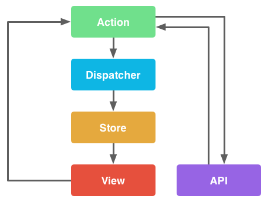

## 14.1 React의 단방향 데이터 흐름 지원

- React는 단방향 데이터 흐름에 따라 작동하도록 설계된 뷰 레이어로, 별도의 로직 없이는 데이터의 변경만으로 뷰를 자동으로 갱신할 수 없음
- 단방향 바인딩은 양방향 바인딩에 비해 흐름 코드의 양이 늘어나긴 하지만 유지보수는 비교적 쉬운 편임

## 14.2 Flux 데이터 아키텍쳐의 이해

- 데이터 흐름을 위한 아키텍쳐 패턴으로 페이스북이 React를 앱에 사용하기 위해 개발함
- MVC 계열 패턴의 복잡도를 제거하기 위해 설계된 아키텍쳐로서 좀 더 나은 테스트와 디버깅을 가능하게 함
- `액션 - 뷰나 사용자 계층에서 발생한 이벤트`가 디스패쳐를 거쳐 스토어의 상태를 변경하면 스토어의 상태를 참조하는 뷰가 변경되는 과정을 반복



## 14.3 Redux 데이터 라이브러리 사용하기

### 14.3.0 개요

#### a. Redux의 특징

- Flux 아키텍쳐의 구현체 중 가장 인기가 많은 모듈로 훌륭한 개발 생태계를 가지고 있음
- 기본적으로는 디스패치나 스토어 등록이 필요하지 않고, 최소화 된 버전은 99행에 불가
- 핫 리로딩과 시간 여행 디버깅이 가능하여 훌륭한 개발자 경험을 제공
- 취소하기 / 다시하기 고차 컴포넌트를 사용하면 최소한의 코드만으로 기능을 구현할 수 있음
- 서버 사이드 렌더링 지원

#### b. React에서 Redux를 사용하기 위한 방법

- React에서 Redux를 사용하려면 `react-redux`라는 라이브러리를 활용할 수 있으며, React에 적용할 때 변경되는 사항이 있음

    - 스토어는 모든 데이터를 관리하는 저장소의 역할 : 스토어 내의 모든 모든 데이터에 대한 변경은 액션에 의해 이뤄며, 이 데이터를 조작할 수 있는 메서드를 제공
    - `createStore(reducer: function, preloadedState?: any, enhancer?: function)`를 사용하여 스토어를 생성할 수 있음
    - `<Provider />` 컴포넌트는 모든 자식 컴포넌트가 스토어에서 데이터를 가져올 수 있도록 만들어 줌
    - `connect(mapStateToProps?: function, mapDispatchToProps?: function, mergeProps?: function, options?: object)`가 반환하는 메서드로 컴포넌트를 감싸서 스토어에 있는 애플리케이션 상태에 접근하도록 함

- 각 액션은 애플리케이션에 발생한 일의 유형과 스토어의 데이터를 변경하기 위해 필요한 데이터를 포함하고 있음

#### d. 리듀서

- 스토어의 변경 방법은 순수 함수인 리듀서에 의해 수행되며, 현재 상태에 변경에 필요한 데이터를 전달하여 새로운 상태를 만들어내는 구조

    - 외부의 간섭 없이 하나의 메서드에서만 로직이 수행되므로 상태를 예측할 수 있고 디버깅이 쉬워짐
    - 리듀서가 순수 함수로 되어있기 때문에 취소 또는 디버깅에 활용하기 좋음
    - 액션을 처리하는 거대한 switch ~ case 문이기 때문에, 이를 읽기 편하게 해줄 수 있는 `redux-actions`라는 라이브러리를 이용할 수 있음

- React 애플리케이션에는 하나 또는 그 이상의 리듀서를 둘 수 있으며, 액션을 호출할 때마다 모든 리듀서가 호출됨
- 리듀서는 스토어의 데이터 변경에 대한 책임이 있으므로 특정 형식의 액션을 다룰 때에는 주의 필요

```js
const reducer = (state = initialState, action) {

    switch (action.type) {

        case 'SET_VISIBILITY_FILTER':

            return Object.assign({}, state, {
                visibilityFilter: action.filter
            });

        case 'ADD_TODO':

            return Object.assign({}, state, {
                todos: [
                    ...state.todos,
                    {
                        text: action.text,
                        completed: false
                    }
                ]
            });

        default:
            return state;
    }
}
```

### 14.3.1 Redux를 이용한 넷플릭스 따라잡기

- 프로젝트 구조는 다음과 같이 설정함

```
.
├── dist                     > 빌드한 결과가 저장되는 경로
├── images                   > 이미지 파일, dist 폴더로 이동하여 정적 자원으로 배포
├── index.html               > 정적 페이지
├── package-lock.json
├── package.json             > 의존성 정보
├── src
│   ├── components           > React 컴포넌트
│   │   ├── app
│   │   │   ├── app.css
│   │   │   └── app.jsx
│   │   ├── movie
│   │   │   ├── movie.css
│   │   │   └── movie.jsx
│   │   └── movies
│   │       ├── movies.css
│   │       └── movies.jsx
│   ├── data
│   │   └── movies.js        > 영화 데이터 정보
│   ├── index.jsx            > 프로그램 진입점
│   ├── reducers             > 리듀서
│   │   ├── index.js
│   │   └── movies.js
│   └── router.jsx           > 라우터 정보
└── webpack.config.js        > Webpack 설정 정보
```

- 프로젝트의 진입점은 `index.jsx`로 시작하여 `app.jsx > router.jsx > movies.jsx > movie.jsx` 순으로 중첩됨
- 기존 템플릿에서 작성해 둔 webpack 설정 코드 중, 일부 설정이 추가되어 변경된 부분만 기술함

```js
// 기존 설정에서 추가된 내용만 기술
const MiniCssExtractPlugin = require('mini-css-extract-plugin');
const HtmlWebpackPlugin = require('html-webpack-plugin');

module.exports = {
    module: {
        rules: [
            {
                test: /\.css$/,
                exclude: [/(node_modules)/],
                use: [
                    {
                        loader: MiniCssExtractPlugin.loader,
                        options: { hmr: true }
                    },
                    {
                        loader: 'css-loader',
                        options: { modules: true }
                    }
                ]
            },
        ]
    },
    resolve: {
        extensions: [ '.js', '.jsx', '.css' ],
        modules : [ './node_modules', './src' ]
    },
    plugins: [
        new MiniCssExtractPlugin({
            filename: 'app.css'
        }),
        new HtmlWebpackPlugin({
            title: 'React Redux',
            template: 'index.html'
        })
    ]
};
```

### 14.3.2 의존 모듈과 빌드 설정

```sh
npm install redux --save-dev
npm install redux-actions --save-dev
npm install react-redux --save-dev

npm install html-webpack-plugin --save-dev
npm install mini-css-extract-plugin --save-dev  # extract-text-webpack-plugin는 deprecated되어 변경
```

### 14.3.3 Redux 사용하기

- `<Provider />` 컴포넌트는 자식 컴포넌트에게 스토어에 접근할 수 있도록 정보를 주입함
- 자식 컴포넌트는 `<Provider />`가 제공하는 스토어에 접근하기 위해서 `connect(mapStateToProps?: function, mapDispatchToProps?: function, mergeProps?: function, options?: object)`가 반환하는 메서드로 감싸야 함

```js
import React from 'react';
import ReactDOM from 'react-dom';
import { createStore } from 'redux';
import { Provider } from 'react-redux';
import App from 'components/app/app';
import reducers from 'reducers';
import AppRouter from 'router';

ReactDOM.render(
    <Provider store={createStore(reducers)}>
        <App>
            <AppRouter />
        </App>
    </Provider>,
    document.getElementById('content')
);
```

### 14.3.4 라우팅

- `react-router-dom`에서 제공하는 컴포넌트를 사용하면 라우팅을 쉽게 구현할 수 있음
- v4.0 버전부터 중첩 라우팅을 지원하지 않기 때문에 아래 2가지 방법 중 하나를 택할 수 있음

    - 라우팅 정보를 하위 컴포넌트에 위임 : 라우팅 정보가 컴포넌트의 일부로 포함되므로 컴포넌트 분리가 어려움
    - 특정 개념 단위로 라우트 정보를 구성하고 하나의 라우터로 병합

```js
import React from 'react';
import { HashRouter, Route } from 'react-router-dom';
import Movies from 'components/movies/movies';

export default class AppRouter extends React.Component {

    render() {
        return (
            <HashRouter basename="/movies">
                <Route exact={true} path={''} component={Movies} />
            </HashRouter>
        );
    }
};
```

### 14.3.5 리듀서 결합하기

- 크케 소스 코드를 수정하지 않고도 여러 리듀서를 연결하여 확장할 수 있도록 `combineReducers(reducers: object)`를 사용

```js
import { combineReducers } from 'redux';
import { movieReducers } from 'reducers/movies';

export default combineReducers({
    movieReducers
});
```

### 14.3.6 영화 목록 리듀서

- 리듀서 자체는 별다른 라이브러리나 모듈의 도움 없이도 구현 가능
- `type` 으로 액션의 종류를 정의하고 데이터와 함께 전달하면 액션의 종류와 데이터를 전달하여 다음 상태를 결정하도록 구현

```js
export const reducer = (state, action) => {

    switch (action.type) {

        case FETCH_MOVIES:

            return {
                ...state,
                movies: action.movies,
            };

        case FETCH_MOVIE:

            return {
                ...state,
                movie: action.movie
            };

        default:
            return state;
    }
}
```

- `redux-actions` 모듈에서 제공하는 `handleActions(reducerMap: object, defaultState: object, options?: object)`을 사용하면 switch ~ case 문 대신 아래와 같은 형식으로 받을 수 있음

```js
export const movieReducers = handleActions({
    [FETCH_MOVIES]: (state, action) => {
        return {
            ...state,
            movies: action.movies
        };
    },
    [FETCH_MOVIE]: (state, action) => {
        return {
            ...state,
            movie: state.movies[action.index - 1]
        }
    }
}, initialState);
```

### 14.3.7 액션

- 스토어의 데이터를 변경하기 위해 필요한 것으로, 브라우저의 입력뿐만 아니라 어떠한 이벤트도 가능
- 모든 액션은 `type` 속성을 가지며, 이 값이 `string` 타입이기 때문에 충돌이 발생하지 않도록 구분 필요

### 14.3.8 액션 생성자

- 매번 어떤 액션이 어떤 `type`을 전달해야 하는지 알기 어렵기 때문에, 액션을 생성하는 메서드를 별도로 두어 편의성을 높일 수 있음

```js
export const fetchMoviesActionCreator = (movies) => ({
    type: FETCH_MOVIES,
    movies
});

export const fetchMovieActionCreator = (index) => ({
    type: FETCH_MOVIE,
    index
});
```

### 14.3.9 컴포넌트를 스토어에 연결하기

- `<Provider />`로 감싸면 스토어의 데이터를 주입할 수 있지만, 자식 컨테이너는 스토어에 연결할지 여부를 결정할 수 있음
- `connect(mapStateToProps?: function, mapDispatchToProps?: function, mergeProps?: function, options?: object)`로 감싼 컴포넌트만 스토어의 데이터에 접근할 수 있으며 아래 두 개의 파라미터를 주로 사용

    - mapStateToProps : 스토어의 상태를 컴포넌트의 속성으로 주입
    - mapDispatchToProps : 스토어의 상태를 변경할 수 있도록 하는 메서드를 속성으로 주입

- `combineReducers(reducers: object)`로 통합한 경우, `mapStateToProps(state: object, ownProps?: object) => object`의 `state` 정보로 리듀서를 주입받음

```js
import styles from './movies.css';

import React from 'react';
import { connect } from 'react-redux';
import { Link, Route } from 'react-router-dom';
import Movie from 'components/movie/movie';

class Movies extends React.Component {

    render() {

        const {
            movies = []
        } = this.props;

        return (
            <div className={styles.movies}>
                <div className={styles.list}>
                    {
                        movies.map((movie, index) => (
                            <Link key={index} to={`/${index + 1}`}>
                                <div className={styles.movie} style={{backgroundImage: `url(${movie.cover})`}}/>
                            </Link>
                        ))
                    }
                </div>
                <Route path={`/:id`} component={Movie} />
            </div>
        );
    }
}

// combineReducers()로 리듀서를 병합했기 때문에 상태 파라미터로 리듀서가 전달됨
const mapStateToProps = ({ movieReducers }) => {

    const { movies } = movieReducers;
    return { movies };
};

export default connect(mapStateToProps)(Movies);
```

### 14.3.10 스토어에 액션 전달하기

- 속성으로 전달되는 `dispatch(action: object)` 메서드로 스토어에 액션을 전달하고 상태를 변경할 수 있음

```js
import styles from './app.css';

import React from 'react';
import { connect } from 'react-redux';
import { fetchMoviesActionCreator } from 'reducers/movies';
import data from 'data/movies';

class App extends React.Component {

    componentDidMount() {
        const action = fetchMoviesActionCreator(data);
        this.props.dispatch(action);
    }

    render() {
        return <div className={styles.app}>{this.props.children}</div>;
    }
}

export default connect()(App);
```

### 14.3.11 컴포넌트 속성으로 액션 생성자 전달하기

- `dispatch(action: object)`를 호출하는 대신 `mapDispatchToProps`에 액션 생성자를 담아 전달하면 컴포넌트의 속성으로 호출 가능
- 컴포넌트 입장에서는 속성으로 전달된 메서드만 호출 가능하기 때문에 훨씬 간편함

```js
import styles from './movie.css';

import React from 'react';
import { Link } from 'react-router-dom';
import { connect } from 'react-redux';
import { fetchMovieActionCreator } from 'reducers/movies';

class Movie extends React.Component {

    componentDidMount() {

        const { match, fetchMovie } = this.props;

        fetchMovie(match.params.id);
    }

    componentDidUpdate(prevProps, prevState) {

        const { match, fetchMovie } = this.props;

        if (match.params.id != prevProps.match.params.id) {
            fetchMovie(prevProps.match.params.id);
        }
    }

    render() {

        const {
            movie = {
                starring: []
            }
        } = this.props;

        return (
            <div>
                ...
                <Link className={styles.closeButton} to={"/"}>&lt;-</Link>
            </div>
        );
    }
}

// combineReducers()로 리듀서를 병합했기 때문에 상태 파라미터로 리듀서가 전달됨
const mapStateToProps = ({ movieReducers }) => {

    const { movie } = movieReducers;
    return { movie };
};

// (dispatch) => object | object
const mapDispatchToProps = {
    fetchMovie: fetchMovieActionCreator
};

export default connect(mapStateToProps, mapDispatchToProps)(Movie);
```

### 14.3.12 넷플릭스 앱 실행하기

```
별다른 내용 없음
```

### 14.3.13 Redux 요약

- Redux는 애플리케이션의 모든 정보를 저장할 수 있는 상태를 제공하며, 이 상태는 서로 간섭되지 않도록 관리할 필요가 있음
- 스토어에 초기 상태를 정의해야 이를 참조하는 컴포넌트도 올바르게 렌더링 할 수 있음
- React 컴포넌트는 일부 라이프사이클 이벤트에서 `setState(state: object)`를 호출할 수 없으나, Redux는 속성으로 값을 전달하므로 유연하게 개발할 수 있음
- 컴포넌트가 스토어에 접근하려면 `connect(mapStateToProps?: function, mapDispatchToProps?: function, mergeProps?: function, options?: object)`가 반환하는 메서드로 감싸야 함
- 스토어 정보를 주입하기 위해 컴포넌트를 `<Provider />`의 자식 컴포넌트로 제공해야 함

## 14.4 기타 - React에 Redux 관련 모듈을 적용하기 위해 알아야 할 모둘 및 API 명세

책에서 설명한 것만으로는 개념적인 이해만 가능했었고, 나머지 API나 모듈의 경우 명세에 대해 알기 어려워 별도로 기술함

### 14.4.1 redux::combineReducers

#### a. 역할

- 특정 개념 단위로 분리한 리듀서를 하나로 묶을 수 있도록 도와주는 메서드

#### b. 파라미터 설명

- reducers : 속성으로 전달할 대상을 키, 합칠 리듀서를 값으로 매핑한 객체를 전달

### 14.4.2 redux-actions::handleActions

#### a. 역할

- 여러 리듀서를 묶어 하나의 리듀서로 반환하는 메서드

#### b. 파라미터 설명

- reducerMap : 리듀서 형식을 Map 타입이나 객체 형태로 제공
- defaultState : 리듀서로 변경할 스토어의 상태에 대한 기본값을 정의

### 14.4.3 react-redux::connect

#### a. 역할

- 스토어와 연결할 수 있는 고차 컴포넌트 함수를 반환하며, 이 함수에 컴포넌트 클래스를 전달하여 스토어와 컴포넌트를 연결

#### b. 파라미터 설명

- mapStateToProps(state: object, ownProps?: object) => object

    - 설명

        - 변경된 스토어의 상태를 컴포넌트의 속성으로 매핑해주는 메서드
        - 스토어의 상태를 마치 컴포넌트의 상태처럼 사용할 수 있도록 도와줌
        - 데이터의 흐름이 `액션 호출 -> 리듀서가 처리 -> 스토어 -> 컴포넌트 속성`으로 흘러가도록 도와줌
        - 스토어의 상태가 변경될 때마다 호출될 콜백 메서드
        - `combineReducers(reducers: object)`로 병합할 경우, `state`에 리듀서가 전달됨

    - 파라미터

        - state : 변경된 스토어의 상태, 상태가 변경 시 호출됨
        - ownProps : 컴포넌트가 가지고 있는 속성 정보, ownProps가 전달되면 상태 변경 외에도 새로운 속성이 전달되면 호출됨

    - 반환 : stateProps로 불리는 객체를 반환하며, 연결된 컴포넌트의 속성으로 주입됨

- mapDispatchToProps(dispatch: function, ownProps?: object) => object

    - 설명

        - 컴포넌트에 액션을 호출할 수 있는 메서드를 속성으로 매핑해주는 메서드
        - 컴포넌트 속성으로 전달된 메서드가 액션을 호출하여 스토어의 상태를 변경할 수 있음

    - 파라미터

        - dispatch : 이 파라미터를 활용하여 액션을 리듀서로 전달할 수 있음
        - ownProps : 컴포넌트가 가지고 있는 속성 정보, ownProps가 전달되면 새로운 속성이 전달되면 호출됨

    - 반환 : dispatchProps로 불리는 객체를 반환하며, 연결된 컴포넌트의 속성으로 주입됨

- mergeProps(stateProps: object, dispatchProps: object, ownProps: object) => object

    - 설명

        - 최종적으로 전달할 속성을 결정하기 위한 필터

    - 파라미터

        - stateProps : mapStateToProps로 컴포넌트에 매핑된 속성
        - dispatchProps : mapDispatchToProps로 매핑된 메서드
        - ownProps : 변경 전 컴포넌트가 가지고 있던 속성

    - 반환 : 로직에 의해 병합된 결과를 객체 형태로 반환하며, 연결된 컴포넌트의 속성으로 주입됨

- options : object

<table>
    <tr>
        <th>속성</th>
        <th>타입</th>
        <th>설명</th>
    </tr>
    <tr>
        <td>context</td>
        <td>React.Context</td>
        <td>v6.0 이상부터 지원하며, 별도의 컨텍스트를 주입하여 </td>
    </tr>
    <tr>
        <td>pure</td>
        <td>boolean</td>
        <td>true일 경우, 불필요하게 mapStateToProp, mapDispatchToProps, mergeProps, render 등의 메서드를 호출하는지 체크함</td>
    </tr>
    <tr>
        <td>areStatesEqual</td>
        <td>(next: object, prev: object) => boolean</td>
        <td>이전 상태와 현재 상태를 비교</td>
    </tr>
    <tr>
        <td>areStatePropsEqual</td>
        <td>(next: object, prev: object) => boolean</td>
        <td>mapStateToProps의 결과와 이전 값을 비교</td>
    </tr>
    <tr>
        <td>areMergedPropsEqual</td>
        <td>(next: object, prev: object) => boolean</td>
        <td>mergeProps의 결과와 이전 값을 비교</td>
    </tr>
    <tr>
        <td>forwardRef</td>
        <td>boolean</td>
        <td>true일 경우, 래핑된 컴포넌트가 아닌 실제 컴포넌트를 전달하도록 전달</td>
    </tr>
</table>
